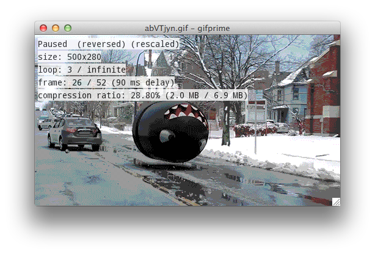

gifprime
========

GIF image decoder, encoder, and playback GUI in Python



Dependencies:
```
pip install -r requirements.txt
```

Pygame may fail to install from pip and need to be installed separately.

Pillow may require installing additional build dependencies to enable loading
different image formats.

Running tests also requires the ImageMagick and exiftool utilities to be
available.

Usage information:
```
python -m gifprime -h
```

Viewer controls:
* `q`: quit
* `s`: toggle scaling
* `i`: toggle info overlay
* `space`: toggle animation playback
* `r`: toggle forward/reverse playback
* `left/right arrow`: go back/forward one frame

Test:
```
py.test
```
